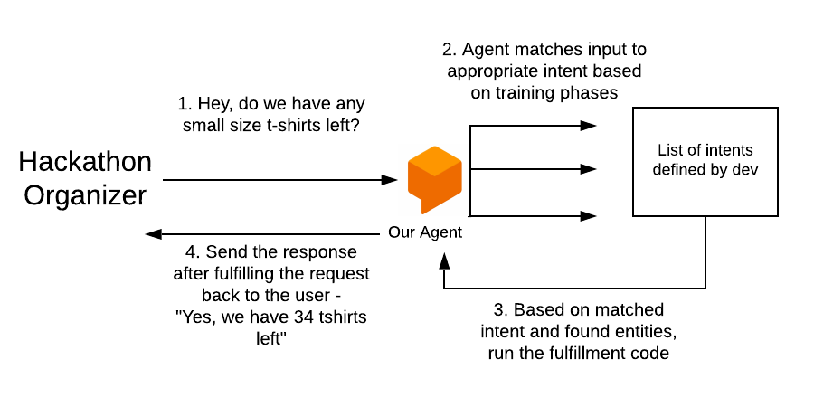
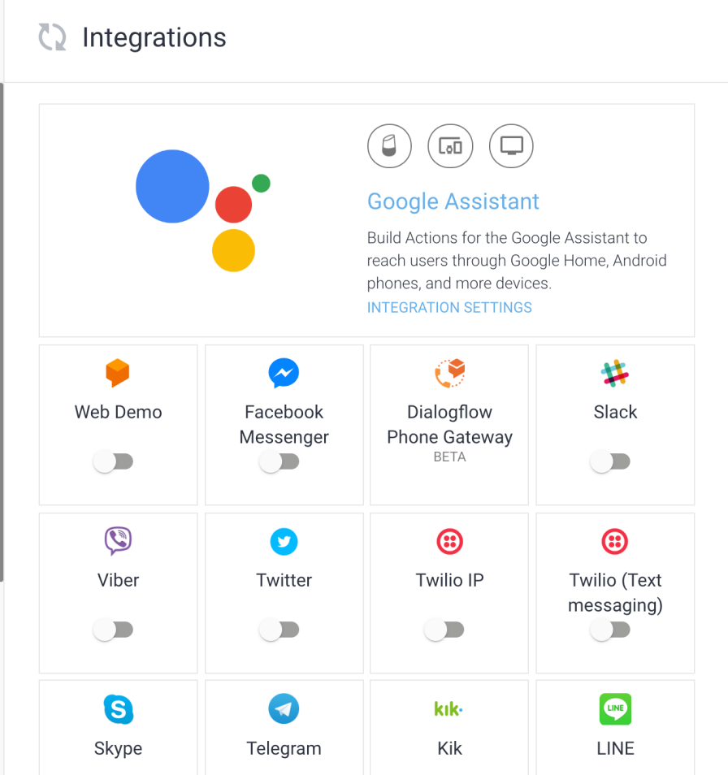

export {dark as theme} from 'mdx-deck/themes'
import { Head, Image, Notes, Appear } from '@mdx-deck/components'
import { Invert, Split, SplitRight, FullScreenCode, Horizontal} from '@mdx-deck/layouts'
import {Examples} from './components/Examples.js'

# Chatbots 🤖

##### An application that runs to simulate human behaviour and hold intelligent conversation. Goal is to pass the [Turing Test](https://en.wikipedia.org/wiki/Turing_test) 
<Examples />

* Types of bots: rule-based or AI-powered
* Why use chatbots: better customer service, automated processes etc

---

#### Let's get hands-on with chatbots and build one!
##### Approaches to building chatbots: 

* Design the AI pipeline and UI from scratch
* Using external API's: 
  * [wit.ai](https://wit.ai/)
  * [IBM Watson API](https://www.ibm.com/watson/services/natural-language-understanding/)
  * [DialogFlow](https://dialogflow.com/)
  
---
#### What we'll build: A chatbot for the team that organizes HackXX
#### Problem: A lot of swag (tshirts, bottles etc) is given out during a hackathon. What if we were able to create an inventory and a bot who maintains and gives info about that inventory?

<ul>
  <Appear>
    <li>Out of the possible "NLP-as-a-service" API's we have, let's use DialogFlow to build this</li>
  </Appear>
</ul>

---

#### Get started with the inventory bot

1. DialogFlow
2. [Firebase database]()
3. [Firebase Cloud Functions](https://medium.freecodecamp.org/firebase-cloud-functions-the-great-the-meh-and-the-ugly-c4562c6dc65d)
 
--- 

#### Fundamentals of DialogFlow

<ul>
  <Appear>
  <li>Agents : Help convert user requests into actionable data/response.</li>
  <li>Intents: configured by developers which indicate what the objective of the user might be when they make a specific request. For Eg. checkInventory, updateItem, removeItem</li>
  <li>Training phrases: Collections of possible utterances that users might say to match an intent. Eg. for checkInventory, "how many small sized tshirts left?"</li>
  </Appear>
</ul>

--- 

#### Fundamentals of DialogFlow (contd.) 

* Entities: Help extract information from user speech with the help of prompts. Eg: "how many `small` sized `tshirts` left?"
<ul>
  <Appear>
    <li>Response: A textual based response given back to the user</li>
    <li>Fullfilment: If we don't need just a textual response, but code that fulfils the intent of the user’s request. Eg: Read/Write to db, make external API calls</li>
  </Appear>
</ul>

--- 
##### Tying these concepts together

---

#### Let's move over to the [DialogFlow](https://dialogflow.com/) [console](https://console.dialogflow.com/) and build this agent

---
export default Split

### Integrations
<ul>
  <Appear>
    <li>Our use-case: Integrate the dialogflow bot into organizing team's slack </li>
  </Appear>
</ul>

---

## Thank you and happy hacking 👋

#### Links: 
1. [https://cses-nlp-workshop.netlify.com/](https://cses-nlp-workshop.netlify.com/)
2. [Code for Firebase cloud functions](https://github.com/kanhegaonkarsaurabh/inventory-bot-functions/blob/master/index.js)
